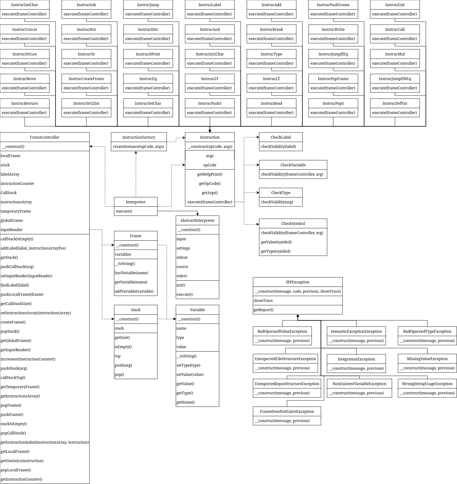

## Implementační dokumentace ke druhé úloze do předmětu IPP 2023/2024
Jméno a příjmení: **Ondřej Novotný** \
Login: **xnovot2p**

### Obecné informace o implementaci
Program je implementace interpreteru do předmětu IPP navazující na `parse.py` je napsán v jazyce PHP8.3 a je rozdělen 
do několika tříd. Vstupní bod programu je soubor interpret.php, který přebírá řízení od Interpreteru z ipp-core. 
Program je logicky rozdělen do tříd, které se starají o různé části interptetace.

### Třídy
- interpreter - Třída která validuje vstupní xml strukturu a stará se o řízení a zajištuje pro jednotlivé instrukce 
logickou spojku. Zadržuje rovněž struktury které by mohla instrukce potřebovat.
- frame - Třída která reprezentuje rámec. Obsahuje metody pro práci s proměnnými v rámci.
- stack - Třída která reprezentuje zásobník. Obsahuje metody pro práci s proměnnými na zásobníku.
- variable - Třída která reprezentuje proměnnou. Obsahuje metody pro práci s proměnnou.
- Frame controller - Třída která slouží pro zadržování dat pro rámce a zásobník. Obsahuje metody pro práci s rámci a zásobníkem.
rovněž uchovává potřebné struktury pro zápis pro čtení a další.
- Instruction factory - Třída která slouží pro vytváření instrukcí. Obsahuje metody pro vytváření instrukcí.
- instruction - Třída která reprezentuje instrukci. Obsahuje metody pro zpracování instrukce a získání jejích argumentů.

### Validace vstupního xml
Vstupní xml je validování uvnitř `interpreter.php` na začátku validace je na hlavičku programu, validní instrukce tagy, 
validní pořadí a validní arg tagy pokud by cokoliv z těchto zmíněných bylo nevalidních interpreter skončí s chybou 32 
Nevalidní XML struktura.


### Implementace objektové továrny
Objektová továrna je implementována pomocí metody createInstance, která vytváří instrukce na základě zadaného názvu instrukce.
Pokud instrukce neexistuje, je vyhozena výjimka. Továrna je implementována jako statická třída, která nemá žádné instance.

```php
public static function createInstance(string $opCode, array $args): Instruction{...}
```

### Implementace instrukcí
Instrukce je implementována jako abstraktní třída, která obsahuaje metody pro zpracování instrukce které si pak každá instance
implementuje sama. Tudíž poté stačí jen zavolat metodu execute a instrukce se provede. A z hlediska programátora je toto velmi
přehledné a jednoduché.
```php
abstract Class Instruction{...}
```

### Implementace Rámcového ovladače
Rámcový ovladač je implementován jako třída, která obsahuje metody pro vytvoření a práci se všemi třemi typy rámců, 
zásobníků a všech polí co byli třeba pro implementaci interpreteru, rovněž obsahuje odkaz na `InputReader` a všechny 
ostatní funkce. Rámcový ovladač je implementován jako singleton, aby bylo možné získat instanci rámcového ovladače
kdekoliv v programu.

```php
class FrameController{...}
```

### Implementace rámcové logiky
Rámec je implementován obecně aby mohl být následně v Rámcovém ovladači zastoupen jako Dočasný rámec pole 
lokálních rámců a globální rámec. v rámci mám implementovanou defaultní funkci __toString která danné proměnnév rámci 
přepíše do řetězcové podoby pro jednoduché zobrazení v break instrukci a exit instrukci.
následně obsahuje addVariable pro přidání proměnné do rámce a hasVariable a getVariable.

```php
class Frame{...}
```

### Implementace zásobníku
Zásobník je implementován pomocí pole ke kterému se přistupuje pomocí funckcí pop, push, top, empty. Zásobník je využit
Hlavně na zásobník volání a pro instrukce které využívají zásobník jako pops a pushs.

```php
class Stack{...}
```

### Implementace proměnných
Proměnné jsou implementovány jako 2 řetězce, a mixed proměnná která uchovává hodnotu proměnné. Které jsou následně 
využity v rámcích které jsou zde uloženy.
```php
class Variable{...}
```

### Celkové zhodnocení implementace
Implementace je velmi přehledná a jednoduchá. Každá třída má jasně definované metody a zodpovědnosti. Díky tomu je 
velmi přehledná a snadno rozšiřitelná. Implementace je relativně modulární proto by šlo v budoucnu snadno rozšířit o další
instrukce nebo třídy podle potřeby.

### Závěr
Projekt jako celek prošel statickou analýzou a testováním na serveru Merlin. Všechny testy byly úspěšně otestovány a
program byl úspěšně odevzdán. Program je napsán v souladu s dokumentací a je plně funkční.

### Diagram

